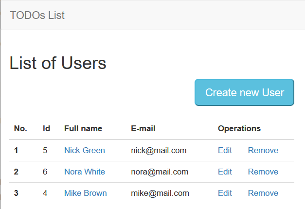
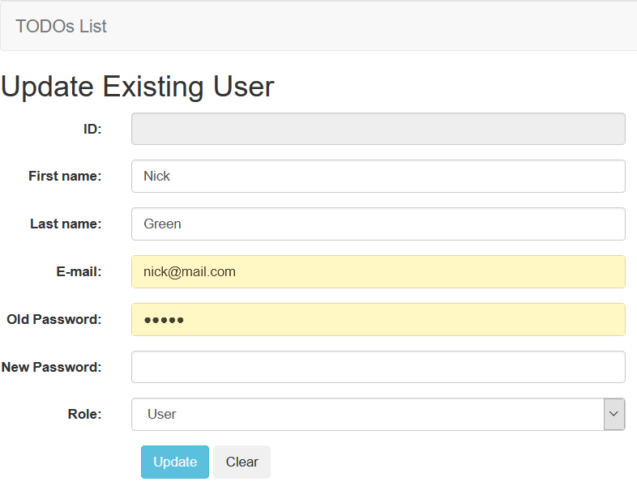

# Java Online Marathon
## Web Application ‘ToDo List’
1. Add needed dependencies for working with web and Thymeleaf to #pom.xml# file
2. Remove comments in all classes in Controller package and add needed code there

### Create Web Application with:

    1. 'Home' page for displaying information about all registered users
    2. 'Update existing user' for updating a user
    3. 'Create New User' page for creating a new user
    4. 'All ToDo lists of <user>' page with showing information about all ToDo lists of some user and adding new ToDo list
    5. 'Update ToDo list' for updating an existing ToDo list
    6. 'Create New ToDo list' page for creating a new ToDo list of some user
    7. 'All Tasks of ToDo list' page where user can see all tasks from some ToDo list and add a new task
    8. 'Create New Task' for creating a new task for some ToDo list of concrete user
    9. 'Update Task' page some existing task

### 'Home' page
'Home' page should contain information about all registered users.

    1. There should be a menu and a table with information about all registered users
    2. When a user clicks on ‘Edit’ link near some user 'Update Existing User' page with filled data 
about the selected user should be opened
    3. When a user clicks on ‘Remove’ link the corresponding user should be deleted
    4. When a user clicks on the 'Create New User' button 'Create New User' page with empty fields should be opened
    5. When the user clicks on the name of some user All ToDo lists of <user>' should be opened

### Menu

    1. Menu should be present on all pages
    2. When the user clicks on the 'ToDos Lists' logo on any page 'Home' page should be opened

### ‘Update Existing User’ page
‘Update existing User’ page should contain filled form with information about the selected user and 'Update' and 'Clear' buttons

    1. When a user clicks on ‘Clear’ button all fields should be cleared
    2. When the user clicks on 'Update’ button' changed data should be saved and 'Home' page should be opened 

### ‘Create New User’ page
‘Create new User’ page should contain a form for creating a new user and 'Register' and 'Clear' buttons

    1. When a user clicks on ‘Clear’ button all fields should be cleared
    2. When the user clicks on 'Register’ button' all entered data should be saved and 'All ToDo Lists of <user>' page should be opened 

### 'All ToDo lists of <user>' page
'All ToDo lists of <user>' page should contain a table with information about all ToDo list some user and 'Create New ToDo list' button

    1. When a user clicks on ‘Edit’ link near some list 'Update ToDo list' page with filled data about the selected list should be opened
    2. When a user clicks on ‘Remove’ link the corresponding list should be deleted
    3. When a user clicks on the 'Create New ToDo list' button 'Create New ToDo List' page with empty fields should be opened
    4. When the user clicks on the name of some list 'All Tasks of <ToDo Lists>' should be opened

### 'All Tasks From <User's ToDo List>'
'All Tasks From <User's ToDo List> should contain 'Create Tasks' button, 'Tasks' table, dropdown for adding collaborators, list all collaborators, and 'Go to ToDo Lists' link

### 'Create New Task' page
'Create New Task' page should contain 'Name' fields, "Priority' dropdown for choosing task priority (e.g. High, Medium, Low), 'Create' and 'Clear' button and 'Go to Task List' link

### 'Update Task' page
'Update Task' page should contain 'Id' (disabled), 'Name' fields, 'Priority' and 'Status' dropdowns, 'Update' and 'Clear' buttons, also there should be added 'Go to Task List' link

Create also pages

    'Create New ToDo List'
    'Update ToDo List' 

Requirements for these pages are the same as the previous descriptions

Implement all needed controllers and templates

*You can use a template project as a basis
Submit links to your Github repository and make a short video (2-5 minutes) where demonstrate the functionality as the result of your work

## Mockup examples (using style files are optional)

### 1. 'Home' page

### 2. 'Update Existing User' page

### 3. 'Create New User' page

### 4. 'All ToDo Lists of <User>' page

### 5. 'All Tasks From <user's> ToDo List'

### 6.'Create New Task' page

### 7. 'Update Task' page

## Set Up DB
If you want to configure and fill your DB automaticly you need to create 'todolist' DB on your server and set properties 
- spring.jpa.hibernate.ddl-auto=create
- spring.datasource.initialization-mode=always
in **application.properties** file

When application starts your DB will be filled data from data.sql file from resources folder

There are three users with ADMIN and USER roles in DB.

| Login         | Password | Role  |
| ------------- |:--------:|:-----:|
| mike@mail.com | 1111     | ADMIN |
| nick@mail.com | 2222     | USER  |
| nora@mail.com | 3333     | USER  |

User with Admin role has access to all data and resources in DB
